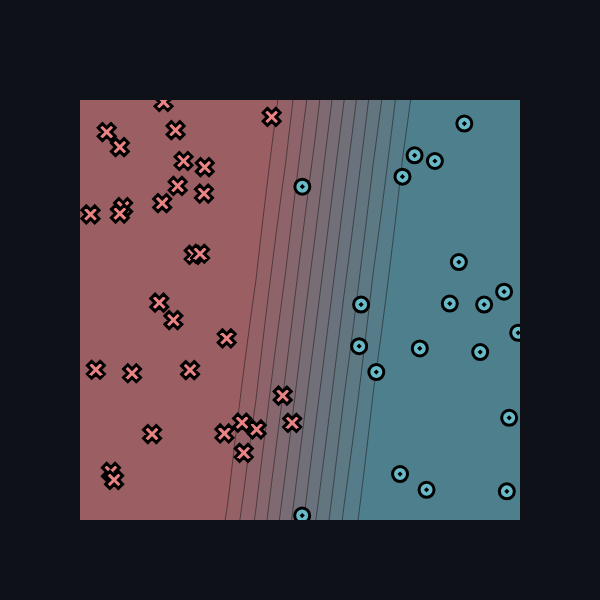
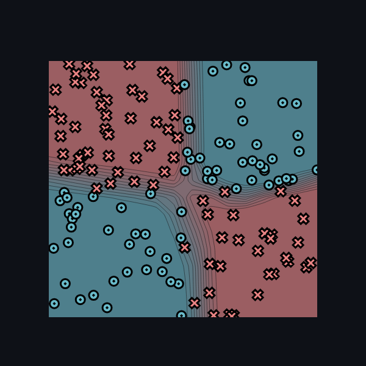

# minitorch
A simple pure python implementation of the pytorch API

## Installation

First, clone this repo.

Install the requirements by running 

`python -m pip install -r requirements.txt`

If you wish to try the interactive demos, also run

`python -m pip install -r requirements.extra.txt`

Finally, install minitorch by running

`python -m pip install -Ue .`

## Module 1 - Autodiff

I built an autodifferentiation engine with scalars, implementing forward and backward passes for various functions, building a computation graph and utilizing the chain rule, and backpropagation.

While it is not the most efficient implementation, this is enough to train a simple neural network. Here are some examples of classifiers trained based on this simple scalar-based implementation.

To train networks based on this scalar implementation, navigate to the `project` folder and run

`python -m streamlit run app.py -- 1`

## Module 2 - Tensors (In progress)

In this section I am implementing tensors to group operations and improve performance. So far I have implemented tensor indexing and broadcasting and operations, and am currently working on debugging the autodiff system to work for tensors.

